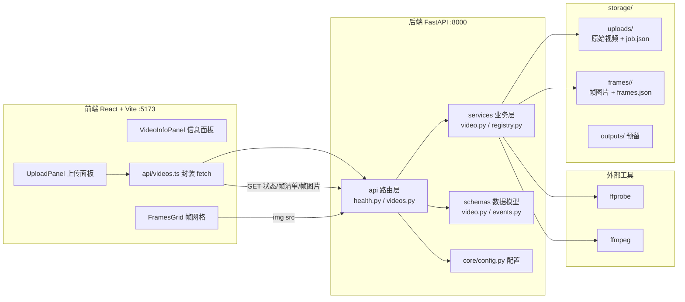

# 架构说明

## 整体架构



前后端分离：前端通过 `/api` 调用后端（开发环境由 Vite proxy 转发到 `http://localhost:8000`，也可用 `VITE_API_BASE_URL` 指定后端地址）；后端以 JSON 返回任务状态与帧清单，帧图片通过 `GET /api/videos/{video_id}/frames/{filename}` 直接以文件响应返回。

## 后端分层

```
backend/app/
├── main.py            # 应用入口：创建 app、注册 CORS 与路由、启动时确保存储目录存在
├── api/               # 路由层：HTTP 入参校验、状态码、响应组装
│   ├── health.py      #   GET /api/health
│   └── videos.py      #   视频上传与结果查询（/api/videos ...）
├── services/          # 业务层：不感知 HTTP
│   ├── video.py       #   ffprobe 元数据解析、ffmpeg 抽帧、frames.json 落盘
│   └── registry.py    #   任务记录（VideoJob）的文件注册表，接口与存储解耦，后续可替换为 PostgreSQL
├── schemas/           # 数据模型（Pydantic）
│   ├── video.py       #   VideoJob / VideoMetadata / FramesInfo / FrameInfo / VideoUploadResponse
│   └── events.py      #   TimelineEvent 统一时间线事件（预留，供 OCR/ASR/视觉/VLM 归一产出）
└── core/
    └── config.py      # Settings（pydantic-settings），lru_cache 单例 get_settings()
```

分层依赖方向：`api` → `services` → `schemas` / `core`。路由层只做校验与编排；`services/video.py` 通过 `subprocess.run` 以参数列表形式调用 ffprobe/ffmpeg（无 shell）；`services/registry.py` 将任务记录以 `job.json` 落盘，对上层屏蔽存储细节。

## 视频上传与抽帧流程

```
POST /api/videos (multipart, 字段 file)
  │
  ├─ 1. 扩展名校验：仅 .mp4/.mov/.mkv，否则 400
  ├─ 2. 生成 video_id（uuid4），流式写入 storage/uploads/{video_id}{ext}
  │      超过 MAX_UPLOAD_SIZE_MB 时删除部分文件并返回 413
  ├─ 3. registry.save_job：创建任务记录 storage/uploads/{video_id}/job.json
  │      （status=processing）
  ├─ 4. 同步触发 app.services.video.process_video(video_id)：
  │      a. ffprobe -show_format -show_streams → VideoMetadata，写回任务记录
  │      b. ffmpeg -vf fps={FRAME_EXTRACTION_FPS} 抽帧到
  │         storage/frames/{video_id}/frame_%06d.jpg，并写 frames.json
  │         （帧清单：frame_id、timestamp_ms、可读时间戳、以 /api/videos/ 开头的访问路径）
  │      c. 任务状态置为 processed
  │      · 处理模块缺失（ImportError）时保持 processing；其他异常置为 failed
  │        且上传接口返回 500
  └─ 5. 返回 201 VideoUploadResponse（video_id、status、metadata、frames）
```

结果查询：

- `GET /api/videos/{video_id}` → 任务记录（VideoJob）。`video_id` 先经格式校验（36 位十六进制/连字符），非法一律 404，防止路径穿越；任务记录文件损坏时返回 500。
- `GET /api/videos/{video_id}/frames` → 读取 `frames/{video_id}/frames.json`；未生成 404，文件损坏 500。
- `GET /api/videos/{video_id}/frames/{filename}` → 帧图片；文件名必须为纯文件名且后缀属于 .jpg/.jpeg/.png，否则 404。

## 前端页面与 API 交互

单页应用（`App.tsx`），以 phase 状态机驱动：`idle → uploading → processing → processed / failed / error`。

1. `UploadPanel`：拖拽或点选单个视频，前端先做扩展名预校验，提交时 `uploadVideo()` 发起 `POST /api/videos`。
2. 上传响应若直接是 `processed` 则展示结果；若为 `processing` 则每 2 秒轮询 `GET /api/videos/{video_id}`，直到 `processed` / `failed`。
3. 成功后调用 `GET .../frames` 拉取帧清单（仅 404 未生成时退回任务记录中携带的帧信息，500/网络异常等错误直接向用户展示），`VideoInfoPanel` 展示元数据，`FramesGrid` 以帧图片 URL（`GET .../frames/{filename}`）渲染帧网格。
4. `failed / error` 状态展示错误信息并允许返回重新上传。

## 存储布局

`STORAGE_DIR`（默认 `storage/`，相对仓库根目录解析）在应用启动时由 `ensure_storage_dirs()` 创建：

```
storage/
├── uploads/
│   ├── {video_id}.mp4            # 原始上传文件（扩展名随上传）
│   └── {video_id}/job.json       # 任务记录：状态、错误、元数据、帧清单、创建时间
├── frames/
│   └── {video_id}/
│       ├── frame_000000.jpg ...  # 抽帧图片
│       └── frames.json           # 帧清单（FramesInfo）
└── outputs/                      # 审核产出（预留，当前无写入方）
```

## AI 模块规划（现状：仅占位）

`ai/` 下五个模块目前均只有 README 占位，无任何实现代码：

- `ai/video`：视频元数据解析与抽帧（当前该能力由后端 `app/services/video.py` 承担）
- `ai/ocr`：画面文字识别
- `ai/asr`：语音转写
- `ai/vlm`：视觉语言大模型理解
- `ai/risk`：多模态风险融合判定

规划中各模态的产出将归一到 `app/schemas/events.py` 定义的 `TimelineEvent`（含 video_id、模态、起止毫秒、内容、置信度），再由风险模块融合判定，结果写入 `storage/outputs/`。

## 配置项

`app/core/config.py` 的 `Settings`，全部支持同名环境变量或 `.env` 覆盖：

| 字段 | 环境变量 | 默认值 | 说明 |
| --- | --- | --- | --- |
| `app_env` | `APP_ENV` | `development` | 应用环境 |
| `backend_host` | `BACKEND_HOST` | `127.0.0.1` | 后端监听地址 |
| `backend_port` | `BACKEND_PORT` | `8000` | 后端监听端口 |
| `storage_dir` | `STORAGE_DIR` | `storage` | 存储目录，相对路径基于仓库根目录 |
| `frame_extraction_fps` | `FRAME_EXTRACTION_FPS` | `2.0` | 抽帧帧率 |
| `max_upload_size_mb` | `MAX_UPLOAD_SIZE_MB` | `500` | 上传文件大小上限（MB） |

其他相关配置：CORS 允许来源在 `main.py` 中固定为 `http://localhost:5173` / `http://127.0.0.1:5173`（Vite 开发服务器）；前端 API 地址为 `VITE_API_BASE_URL`（默认空串，走 Vite proxy）。
