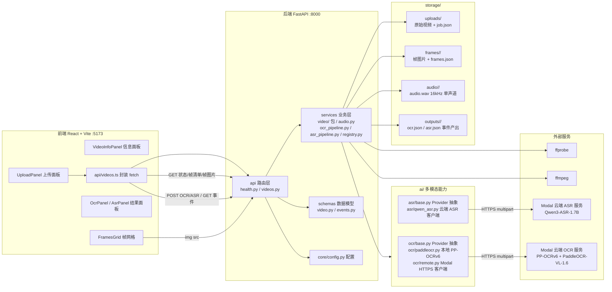

# 架构说明

## 整体架构



前后端分离：前端通过 `/api` 调用后端（开发环境由 Vite proxy 转发到 `http://localhost:8000`，也可用 `VITE_API_BASE_URL` 指定后端地址）；后端以 JSON 返回任务状态与帧清单，帧图片通过 `GET /api/videos/{video_id}/frames/{filename}` 直接以文件响应返回。

## 后端分层

```
backend/app/
├── main.py            # 应用入口：创建 app、注册 CORS 与路由、启动时确保存储目录存在
├── api/               # 路由层：HTTP 入参校验、状态码、响应组装
│   ├── health.py      #   GET /api/health
│   └── videos.py      #   视频上传与结果查询、OCR/ASR 触发与事件查询（/api/videos ...）
├── services/          # 业务层：不感知 HTTP
│   ├── video/         #   视频处理包：__init__.py（ffprobe 元数据、固定帧率抽帧、frames.json 落盘、流程编排）
│   │   └── scene.py   #   镜头切换检测（scene_change 采样模式）
│   ├── audio.py       #   音频提取：ffprobe 音轨探测 + ffmpeg 提取 16kHz 单声道 PCM wav（临时文件+校验+原子替换）
│   ├── ocr_pipeline.py#   OCR 编排：读 frames.json → 逐帧识别 → TimelineEvent → ocr.json
│   ├── asr_pipeline.py#   ASR 编排：确保 audio.wav → 云端识别 → TimelineEvent → asr.json（默认幂等复用）
│   ├── modality_store.py # 模态事件原子落盘与损坏恢复（OCR/ASR/后续 VLM 共用）
│   └── registry.py    #   任务记录（VideoJob）的文件注册表，接口与存储解耦，后续可替换为 PostgreSQL
├── schemas/           # 数据模型（Pydantic）
│   ├── video.py       #   VideoJob / VideoMetadata / FramesInfo / FrameInfo / SamplingInfo / VideoUploadResponse
│   └── events.py      #   TimelineEvent 统一时间线事件 / ModalityRunResponse（OCR/ASR 已落地，视觉/VLM 预留）
└── core/
    └── config.py      # Settings（pydantic-settings），lru_cache 单例 get_settings()

ai/                    # 多模态能力包（仓库根，经 sys.path/pythonpath 可被 backend 与 pytest 导入）
├── ocr/
│   ├── base.py        #   OcrProvider 抽象基类 + OcrTextLine，业务层只依赖此接口
│   ├── paddleocr.py   #   PaddleOcrProvider：本地 PP-OCRv6 实现，惰性单例，模型/语言/设备走配置
│   ├── remote.py      #   RemoteOcrProvider：Modal 云端 OCR 的 HTTPS 客户端（httpx），契约解析严格校验
│   └── factory.py     #   默认 Provider 入口（按 OCR_PROVIDER=local|modal 分派，业务层不 import 具体实现）
└── asr/
    ├── base.py        #   AsrProvider 抽象 + AsrSegment/AsrResult + 抽象异常（AsrProviderError 等）
    ├── qwen_asr.py    #   QwenAsrProvider：Modal 云端 Qwen3-ASR 的 HTTPS 客户端（httpx），只抛抽象异常
    └── factory.py     #   默认 Provider 入口（按配置分派，业务层不 import 具体实现）
```

分层依赖方向：`api` → `services` → `ai` / `schemas` / `core`。路由层只做校验与编排；`services/video` 包与 `services/audio.py` 通过 `subprocess.run` 以参数列表形式调用 ffprobe/ffmpeg（无 shell）；`services/registry.py` 将任务记录以 `job.json` 落盘，对上层屏蔽存储细节；`services/ocr_pipeline.py` / `services/asr_pipeline.py` 只依赖 `ai.ocr.base` / `ai.asr.base` 的 Provider 抽象与工厂入口，不感知具体引擎（有防回归测试约束）。

## 视频上传与抽帧流程

```
POST /api/videos (multipart, 字段 file，可选字段 sampling=fixed_fps|scene，默认 fixed_fps)
  │
  ├─ 1. 扩展名校验：仅 .mp4/.mov/.mkv，否则 400；sampling 非法值返回 400
  ├─ 2. 生成 video_id（uuid4），流式写入 storage/uploads/{video_id}{ext}
  │      超过 MAX_UPLOAD_SIZE_MB 时删除部分文件并返回 413
  ├─ 3. registry.save_job：创建任务记录 storage/uploads/{video_id}/job.json
  │      （status=processing，记录 sampling 模式）
  ├─ 4. 同步触发 app.services.video.process_video(video_id, sampling)：
  │      a. ffprobe -show_format -show_streams → VideoMetadata，写回任务记录
  │      b. 按 sampling 模式抽帧到 storage/frames/{video_id}/ 并写 frames.json
  │         （帧清单：sampling 信息、frame_id、timestamp_ms、可读时间戳、
  │         以 /api/videos/ 开头的访问路径）
  │      c. 任务状态置为 processed
  │      · 处理模块缺失（ImportError）时保持 processing；其他异常置为 failed
  │        且上传接口返回 500
  └─ 5. 返回 201 VideoUploadResponse（video_id、status、sampling、metadata、frames）
```

两种采样模式：

- `fixed_fps`（默认）：`ffmpeg -vf fps={FRAME_EXTRACTION_FPS}` 固定帧率抽帧，frames.json 的 sampling 记录 `{method: "fixed_fps", fps}`。
- `scene`（镜头切换检测）：先以 `ffmpeg -vf select='gt(scene,{SCENE_THRESHOLD})',showinfo -f null -` 跑一遍全片，从 showinfo 输出用正则解析命中帧的 pts_time 得到毫秒级镜头边界；再对每个边界用 `ffmpeg -ss` 精确截取一帧，并额外保留 t=0 起始帧作为首个镜头的代表帧。frames.json 的 sampling 记录 `{method: "scene_change", threshold}`。镜头数量超过 `SCENE_MAX_FRAMES`（默认 500）时截断并记警告日志，防止异常视频产生海量帧。ffmpeg 缺失、检测失败或超时均明确抛错，任务置为 failed。

结果查询：

- `GET /api/videos/{video_id}` → 任务记录（VideoJob）。`video_id` 先经 `uuid.UUID` 严格校验，非法格式返回 400，防止路径穿越；任务记录文件损坏时返回 500。
- `GET /api/videos/{video_id}/frames` → 读取 `frames/{video_id}/frames.json`；未生成 404，文件损坏 500。
- `GET /api/videos/{video_id}/frames/{filename}` → 帧图片；文件名必须为纯文件名且后缀属于 .jpg/.jpeg/.png，否则 404。

## OCR 分支：Video → Frames → OCR → TimelineEvent(ocr)

```
POST /api/videos/{video_id}/ocr
  │
  ├─ 1. video_id 校验；任务记录不存在 404
  ├─ 2. frames.json 不存在（未抽帧）返回 409 并提示先完成抽帧；损坏返回 500
  ├─ 3. services/ocr_pipeline.run_ocr 同步执行（本阶段不引入任务队列）：
  │      a. 逐帧调用 ai.ocr 的 OcrProvider.recognize（惰性单例，工厂按
  │         OCR_PROVIDER 选择本地 PaddleOcrProvider 或 RemoteOcrProvider）
  │      b. 每帧文字行聚合为 TimelineEvent：modality='ocr'，
  │         start_ms=end_ms=帧的 timestamp_ms（与抽帧时间轴严格对齐，
  │         供后续 ASR/视觉/VLM 事件在同一时间轴上融合）；
  │         content 为各行文本换行拼接，confidence 取各行均值，
  │         逐行明细（text/confidence/box）保留在 metadata.lines
  │      c. 无文本帧不产事件；单帧识别失败记 warning 跳过，不中断整体
  │      d. 结果落盘 storage/outputs/{video_id}/ocr.json
  │         （{video_id, modality, events: [...]}）
  └─ 4. 返回 {video_id, modality: 'ocr', event_count}

GET /api/videos/{video_id}/events?modality=ocr
  └─ 读取 outputs/{video_id}/{modality}.json 返回 TimelineEvent 列表；
     未生成 404，文件损坏 500；modality 取值受枚举校验（ocr/asr/vision/vlm）
```

OCR 部署形态由 `OCR_PROVIDER`（默认 `local`）决定：`local` 走 `ai/ocr/paddleocr.py` 的 PaddleOcrProvider（PaddleOCR 官方包，默认 CPU）；`modal` 走 `ai/ocr/remote.py` 的 RemoteOcrProvider，以 multipart 上传 JPEG 到 `POST {MODAL_OCR_URL}/recognize`（表单字段 `model` 携带模型标识），响应 `{"lines":[{text,bbox,confidence}]}` 经严格解析（缺 `lines`/行字段、bbox 非四角坐标列表、置信度非有限数值均抛 `OcrResponseFormatError`）；超时抛 `OcrTimeoutError`，网络错误与非 2xx 抛 `OcrServiceError`。`OCR_PROVIDER=modal` 但 `MODAL_OCR_URL` 为空时工厂回退 local 并记警告日志。云端服务部署见 `modal/ocr/`：主模型 PP-OCRv6（T4），PaddleOCR-VL-1.6 仅在已检出文字且最低置信度低于阈值时同容器调用；空图返回空 `lines`，畸形输入 4xx。`MODAL_OCR_URL` 配置层要求生产端点为 https，禁止 URL 凭据，仅 `http://127.0.0.1` / `http://localhost` 作为本地测试 stub。

OCR 引擎依赖（paddleocr/paddlepaddle）只在 `ai/ocr/paddleocr.py` 内延迟导入，未安装 OCR 环境时后端其余功能与测试照常运行。Windows 环境下 paddle 与 torch 共存时必须先导入 torch（否则 torch 的 shm.dll 解析失败拖垮 modelscope → paddlex → paddleocr 导入链），该约束已在 `ai/ocr/paddleocr.py` 内处理并注释。远端 Provider 不加载这些依赖。

## ASR 分支：Video → Audio → 云端 ASR → TimelineEvent(asr)

拓扑约束：ASR 推理全部在 Modal 云端（Qwen3-ASR-1.7B），本地只跑业务管线——提取音频并经 HTTPS 调用，不加载任何 ASR 模型权重。

```
POST /api/videos/{video_id}/asr?force=false
  │
  ├─ 1. video_id 经共享 normalize_video_id（UUID）校验；任务记录不存在 404
  ├─ 2. services/asr_pipeline.run_asr 同步执行（本阶段不引入任务队列）：
  │      a. 默认复用已有且完好的 asr.json（返回 reused=true）；
  │         损坏的 asr.json 删除后重跑；force=true 才忽略已有结果
  │      b. services/audio.ensure_audio：有效 audio.wav 复用，缺失或损坏
  │         （空文件、wave 无法识别、非 16kHz 单声道）则重新提取——
  │         按允许扩展名枚举上传文件（无音轨 409，上传缺失 409），
  │         ffmpeg 写入临时文件，校验通过后原子替换 audio.wav；
  │         超时删除半成品并抛 AudioExtractTimeoutError（API 映射 504）
  │      c. 调用 ai.asr 的 AsrProvider.transcribe（惰性单例）：
  │         QwenAsrProvider 以 multipart 上传 wav 到
  │         POST {MODAL_ASR_URL}/transcribe（表单字段 model 携带模型标识），
  │         响应 {"segments": [{text,start_ms,end_ms,confidence}], language}
  │         经严格解析（缺字段/类型非法/非有限数值/时间区间非法均抛
  │         AsrResponseFormatError）；超时抛 AsrTimeoutError（504），
  │         网络错误与非 2xx 抛 AsrServiceError（502），
  │         未配置端点抛 AsrNotConfiguredError（503）。
  │         异常定义在 ai/asr/base.py，API 不 import 具体实现
  │      d. 每个分段聚合为 TimelineEvent：modality='asr'，
  │         按 (start_ms, end_ms) 稳定排序；start_ms/end_ms 取分段区间，
  │         content 为分段文本，confidence 截断到 [0, 1]，
  │         语言与原始分段序号保留在 metadata；空文本分段不产事件
  │      e. 结果经 write_modality_events 原子落盘
  │         storage/outputs/{video_id}/asr.json
  └─ 3. 返回 {video_id, modality: 'asr', event_count, reused}

GET /api/videos/{video_id}/events?modality=asr
  └─ 复用通用事件端点，读取 outputs/{video_id}/asr.json（无需改动）
```

音频提取的采样率与声道数由 ASR 服务契约固定（16kHz 单声道 PCM wav），不走配置；云端端点、模型名与请求超时走配置（`modal_asr_url` / `asr_primary_model` / `asr_request_timeout_seconds`）。`MODAL_ASR_URL` 未配置（空）时 Provider 初始化抛 `AsrNotConfiguredError`；配置层要求生产端点为 https，禁止 URL 凭据，仅 `http://127.0.0.1` / `http://localhost` 作为本地测试 stub。时间戳对齐模型（Qwen3-ForcedAligner-0.6B）由云端服务内部使用，本地仅以 `asr_aligner_model` 记录标识。OCR 与 ASR 的 `{modality}.json` 均经 `write_modality_events` 原子写入。

## 模型选型与 Provider 抽象

多模态能力的统一约定：每个模态在 `ai/{modality}/base.py` 定义 Provider 抽象（输入输出契约），具体引擎以同接口实现并惰性加载，模型标识全部走 `core/config.py` 配置（禁止散落在业务代码）；业务编排只依赖 base 抽象，更换引擎不影响编排与路由。

- OCR：主模型 PP-OCRv6。`OCR_PROVIDER=local`（默认）使用 `ai/ocr/paddleocr.py` 的 PaddleOcrProvider（PaddleOCR 官方包，默认 CPU）；`OCR_PROVIDER=modal` 使用 `ai/ocr/remote.py` 的 RemoteOcrProvider（HTTPS 客户端，本地不加载 OCR 权重）。备用疑难模型 PaddleOCR-VL-1.6 由配置 `ocr_fallback_model` 记录标识，在 Modal 云端服务内于低置信时调用（`modal/ocr/`），本地 Provider 不加载。模型名、语言、设备、端点见配置项表的 `ocr_*` / `modal_ocr_url` 项。
- ASR：主模型 Qwen3-ASR-1.7B，部署在 Modal 云端（`ai/asr/qwen_asr.py` 的 QwenAsrProvider 为 HTTPS 客户端，本地不加载模型权重）；时间戳对齐模型 Qwen3-ForcedAligner-0.6B 由云端服务内部使用，本地仅以 `asr_aligner_model` 记录标识。端点、模型名、超时见配置项表的 `modal_asr_url` / `asr_*` 项。
- 视觉 / VLM / 风险融合：尚未实现，接入时遵循同一 Provider 约定（base 抽象 + 配置驱动 + 惰性加载），产出统一归一到 TimelineEvent。

## 前端页面与 API 交互

单页应用（`App.tsx`），以 phase 状态机驱动：`idle → uploading → processing → processed / failed / error`。

1. `UploadPanel`：拖拽或点选单个视频并选择采样模式（固定帧率 2FPS / 镜头切换检测），前端先做扩展名预校验，提交时 `uploadVideo()` 携带 sampling 字段发起 `POST /api/videos`。
2. 上传响应若直接是 `processed` 则展示结果；若为 `processing` 则每 2 秒轮询 `GET /api/videos/{video_id}`，直到 `processed` / `failed`。
3. 成功后调用 `GET .../frames` 拉取帧清单（仅 404 未生成时退回任务记录中携带的帧信息，500/网络异常等错误直接向用户展示），`VideoInfoPanel` 展示元数据，`FramesGrid` 以帧图片 URL（`GET .../frames/{filename}`）渲染帧网格。
4. 结果区的 `OcrPanel` / `AsrPanel` 分别提供「运行 OCR」「运行 ASR」按钮：触发 `POST .../ocr` / `POST .../asr` 后拉取 `GET .../events?modality=ocr|asr`，OCR 以时间戳 + 文本 + 置信度、ASR 以时间段（起止时间戳）+ 文本 + 置信度列表展示事件；ASR 的 409（无音轨/原始文件缺失）直接展示后端返回的提示。
5. `failed / error` 状态展示错误信息并允许返回重新上传。

## 存储布局

`STORAGE_DIR`（默认 `storage/`，相对仓库根目录解析）在应用启动时由 `ensure_storage_dirs()` 创建：

```
storage/
├── uploads/
│   ├── {video_id}.mp4            # 原始上传文件（扩展名随上传）
│   └── {video_id}/job.json       # 任务记录：状态、错误、元数据、帧清单、创建时间
├── frames/
│   └── {video_id}/
│       ├── frame_000000.jpg ...  # 抽帧图片
│       └── frames.json           # 帧清单（FramesInfo）
├── audio/
│   └── {video_id}/
│       └── audio.wav             # ASR 用音频（16kHz 单声道 PCM，首次 ASR 时自动提取）
└── outputs/                      # 审核产出
    └── {video_id}/
        ├── ocr.json              # OCR 事件产出（{video_id, modality, events}）
        └── asr.json              # ASR 事件产出（同结构）
```

## AI 模块现状

`ai/` 下五个模块中，`ai/ocr` 与 `ai/asr` 已实现（见上文「模型选型与 Provider 抽象」）；`ai/video`、`ai/vlm`、`ai/risk` 仍只有 README 占位：

- `ai/video`：视频元数据解析与抽帧（当前该能力由后端 `app/services/video` 包承担）
- `ai/vlm`：视觉语言大模型理解
- `ai/risk`：多模态风险融合判定

各模态的产出将归一到 `app/schemas/events.py` 定义的 `TimelineEvent`（含 video_id、模态、起止毫秒、内容、置信度），再由风险模块融合判定，结果写入 `storage/outputs/`。

## 配置项

`app/core/config.py` 的 `Settings`，全部支持同名环境变量或 `.env` 覆盖（`.env` 固定从仓库根目录读取，与 README 的启动方式一致）：

| 字段 | 环境变量 | 默认值 | 说明 |
| --- | --- | --- | --- |
| `app_env` | `APP_ENV` | `development` | 应用环境 |
| `backend_host` | `BACKEND_HOST` | `127.0.0.1` | 后端监听地址 |
| `backend_port` | `BACKEND_PORT` | `8000` | 后端监听端口 |
| `storage_dir` | `STORAGE_DIR` | `storage` | 存储目录，相对路径基于仓库根目录 |
| `frame_extraction_fps` | `FRAME_EXTRACTION_FPS` | `2.0` | 抽帧帧率，必须大于 0，非法值在启动时即报错 |
| `scene_threshold` | `SCENE_THRESHOLD` | `0.4` | 镜头切换检测的场景分数阈值，必须在 (0, 1) 区间 |
| `scene_max_frames` | `SCENE_MAX_FRAMES` | `500` | 镜头切换检测的最大抽帧数，超出部分截断 |
| `max_upload_size_mb` | `MAX_UPLOAD_SIZE_MB` | `500` | 上传文件大小上限（MB） |
| `ocr_primary_model` | `OCR_PRIMARY_MODEL` | `PP-OCRv6` | 主 OCR 模型（PaddleOCR ocr_version） |
| `ocr_fallback_model` | `OCR_FALLBACK_MODEL` | `PaddleOCR-VL-1.6` | 备用疑难 OCR 模型标识；云端服务低置信时调用，本地不加载 |
| `ocr_lang` | `OCR_LANG` | `ch` | OCR 识别语言 |
| `ocr_use_gpu` | `OCR_USE_GPU` | `false` | OCR 是否使用 GPU，默认 CPU（仅 local 形态） |
| `ocr_provider` | `OCR_PROVIDER` | `local` | OCR 部署形态：`local` 或 `modal` |
| `modal_ocr_url` | `MODAL_OCR_URL` | 空 | Modal 云端 OCR 服务 HTTPS 地址（不含路径）；`OCR_PROVIDER=modal` 且为空时工厂回退 local；禁止凭据，本地 stub 允许 http://127.0.0.1 / http://localhost |
| `ocr_request_timeout_seconds` | `OCR_REQUEST_TIMEOUT_SECONDS` | `120` | 云端 OCR 服务请求超时（秒），必须大于 0 |
| `modal_asr_url` | `MODAL_ASR_URL` | 空 | Modal 云端 ASR 服务 HTTPS 地址（不含路径），未配置时 ASR 不可用；禁止凭据，本地 stub 允许 http://127.0.0.1 / http://localhost |
| `asr_primary_model` | `ASR_PRIMARY_MODEL` | `Qwen3-ASR-1.7B` | 主 ASR 模型标识 |
| `asr_aligner_model` | `ASR_ALIGNER_MODEL` | `Qwen3-ForcedAligner-0.6B` | 时间戳对齐模型标识，仅记录不加载，云端服务内部使用 |
| `asr_request_timeout_seconds` | `ASR_REQUEST_TIMEOUT_SECONDS` | `120` | 云端 ASR 服务请求超时（秒），必须大于 0 |

其他相关配置：CORS 允许来源在 `main.py` 中固定为 `http://localhost:5173` / `http://127.0.0.1:5173`（Vite 开发服务器）；前端 API 地址为 `VITE_API_BASE_URL`（默认空串，走 Vite proxy）。
